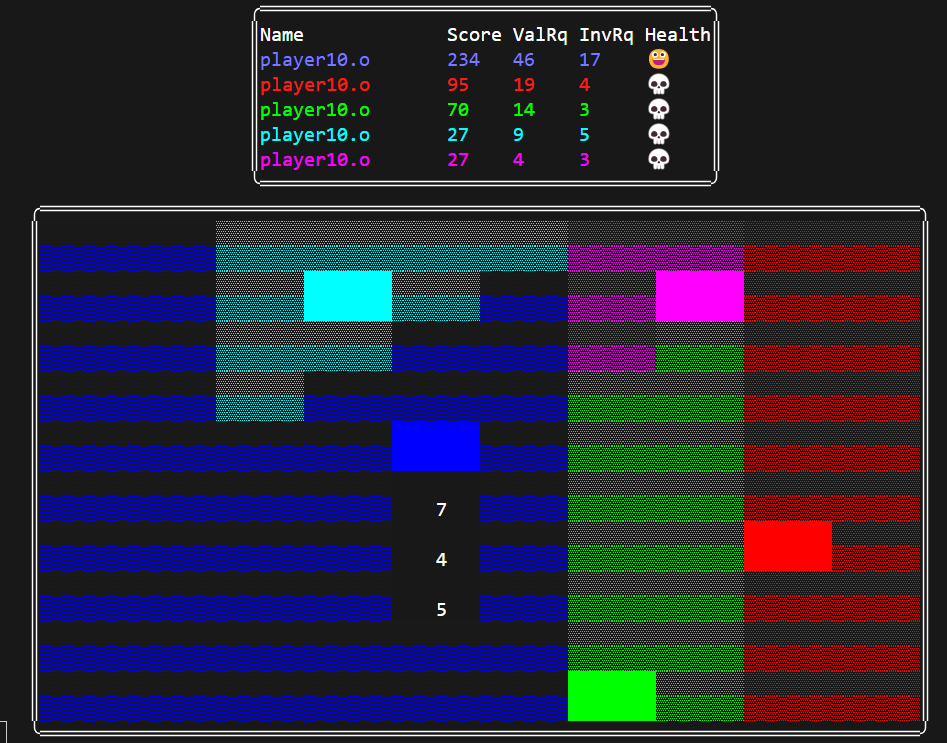

# TP1-SO-ITBA-2025Q1

Grupo 10 <!-- Que se quiere sacar 10 -->

## Nota 


* Deadline. [**1/1** punto]
* Funcionalidad (Mandatorio). [**4/4** puntos]
* Calidad de código. [**1.5/3** puntos]
    <details>
        <summary>Comentarios</summary>
        <ul>
        <li>Entiendo que intentaron replicar el master, pero ARI no es un nombre representativo para constantes</li>
        <li> Valoro el esfuerzo de separar el código en diferentes unidades de compilación, pero hay algunas incoherencias. askViewToPrint no forma parte de la la lógica del juego (un)lockGameStateReads tampoco y a la vez waitToRead y finishReading están en player directamente. Podría haber una UC destinada a sync.</li>
        <li> ipc.c junta TODOS los ipcs usados, pero podría estar perfectamente separado shm, de pipes y sem</li>
        <li> Esta falta de separación se observa también en utils.h que junta todos los structs.</li>
        <li> utils no es el nombre más feliz para esa carpeta</li>
        <li> Si algo hay que ponerle de nombre "varios" o "utils" porque no hay un nombre específico más adecuado, es un claro síntoma de que hace falta un refactor y se están mezclando responsabilidades.</li>
    </ul>   
    </details>
* Limpieza de recursos del sistema. [**1/1** punto]
* Informe. [**1/1** punto]


```md
▄▖▌        ▄▖▌          
▌ ▛▌▛▌▛▛▌▛▌▌ ▛▌▀▌▛▛▌▛▌▛▘
▙▖▌▌▙▌▌▌▌▙▌▙▖▌▌█▌▌▌▌▙▌▄▌
         ▌          ▌   
```

> [!WARNING]
>
> ## Requirements
>
> `Docker`, `agodio/itba-so-multi-platform:3.0` and a `PVS-Studio` license

> [!IMPORTANT]
>
> ## Build
>
> Run the `run.sh` file to enter the docker container
>
> ```sh
> ./run.sh
>
> # Or enter manually
> docker run --rm -v ${PWD}:/root --security-opt seccomp:unconfined -it agodio/itba-so-multi-platform:3.0
> ```
>
> Then, enter `root` and execute `make`
>
> ```sh
> cd ~
> make all
> ```
>
> Lastly, execute the `ChompChamps` binary
>
> ```sh
> make run p=<PLAYERS> w=<WIDTH> h=<HEIGHT> d=<DELAY> t=<TIMEOUT>
> 
> # Or enter manually
> ./bin/master.o -p ./bin/player10.o -v ./bin/view.o
> ```
>
> If you want to use the original binary provided, it is located in `bin/originales/`. Optionally, you can use the parameter `m=original` in the `make run`

> [!NOTE]
>
> ## Parameters
>
> - `[-w width]`: Board width. **Default and min**: `10`
> - `[-h height]`: Board height. **Default and min**: `10`
> - `[-d delay]`: Print wait time in `ms`. **Default**: `10`
> - `[-t timeout]`: Movement request timeout in `s`. **Default**: `200`
> - `[-s seed]`: Seed utilized for generating the board. **Default**: `time(NULL)`
>   - **In `make_run`**: `time(NULL)`, unmodifiable
> - `[-v view]`: View binary route. **Default**: No view
>   - **In `make_run`**: `bin/view.o`, unmodifiable
> - `-p player1 player2`
>   - **In `make_run`**: `bin/player10.o`, unmodifiable, you can only decide the amount of players

> [!NOTE]
>
> ## PVS-Studio analyzer & Valgrind
>
> Register your PVS-Studio credentials:
>
> ```sh
> pvs-studio-analyzer credentials "<Your User>" "XXXX-XXXX-XXXX-XXXX"
>
> make pvs # Will generate the PVS-Studio files
> ```
>
> If you want to use the Valgrind tool, you can use `make run_valgrind` with the same parameters as `make_run`. Optionally, you can run it manually:
>
> ```sh
> valgrind ./bin/master.o -p ./bin/player10.o -v ./bin/view.o
> ```
